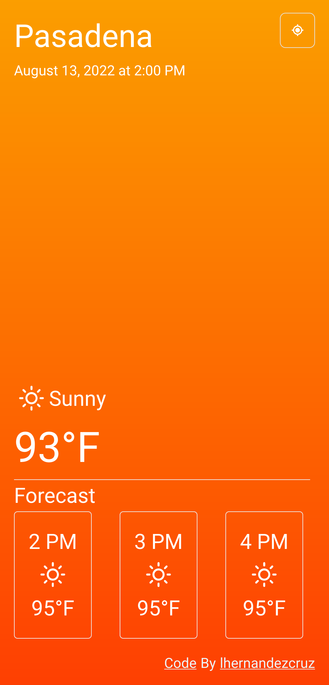

# WeatherApp

A web app that gets the weather at your current location and displays it in a simplified manner. [Try Now](https://weather.lhernandezcruz.com).

## Usage

The initial location is set to Mountain View, CA but clicking the current location icon will update the weather based on the location provided by the web browser.

## Built With
* [Geolocation Web APIs](https://developer.mozilla.org/en-US/docs/Web/API/Geolocation) - Web Browser API that prompts user for location
* [OpenWeatherMap](https://www.openweathermap.org) - Provides weather information
* [React](https://reactjs.org/) - JS library for building web interfaces
* [Chakra UI](https://reactjs.org/) - Component library for simplified styling

## Legacy

The first iteration of the weather app was created just using html, js, and css. The site is served using github pages and used for demonstrative purposes of how one might first pick up webdev skills. [Try Now](https://lhernandezcruz.github.io/WeatherApp/).

The legacy version of the app uses [ipinfo.io](https://ipinfo.io/) to obtain city and country of the user (without prompting user).

## Authors
* Luis Hernandez Cruz - [lhernandezcruz](https://github.com/lhernandezcruz)
